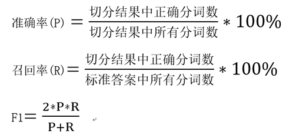
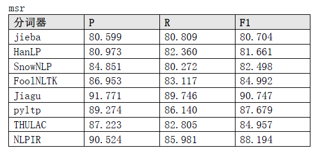
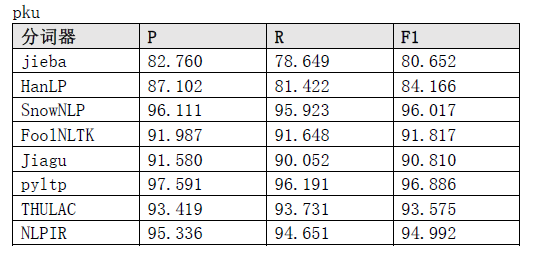
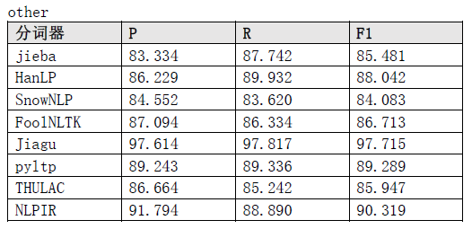
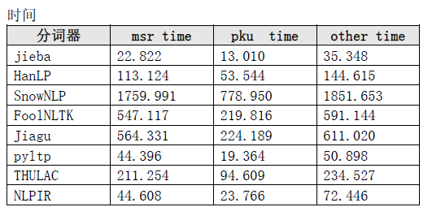

# 中文分词性能对比
>>> 以下分词工具均能在Python环境中直接调用（排名不分先后）。

* jieba（结巴分词）                                      免费使用
* HanLP（汉语言处理包）                           免费使用
* SnowNLP（中文的类库）                          免费使用
* FoolNLTK（中文处理工具包）                  免费使用
* Jiagu（甲骨NLP）                                      免费使用
* pyltp（哈工大语言云）                              商用需要付费
* THULAC（清华中文词法分析工具包）     商用需要付费
* NLPIR（汉语分词系统）                             付费使用

分词工具使用方式见[Tutorial](Tutorial.md)。每个分词工具可能有多种分词模式，本文所对比的为默认分词模式。

---
### 计算公式：

---

### 使用方式：
```shell
pip install jieba
pip install pyhanlp
pip install snownlp
pip install foolnltk
pip3 install jiagu==0.1.2
pip install pyltp      # 需要下载模型，模型地址见上诉Tutorial教程，模型所放的路径与Tutorial同
pip install thulac
pip install pynlpir    # 安装好后需要使用证书，见上诉Tutorial教程

git clone https://github.com/ownthink/evaluation.git
cd evaluation
python3 test.py   # 测试工具是否能够使用
python3 eval.py  # 测试（时间较长）
```

### 测试集：
* msr
* pku		
* other

1. msr测试结果



2. pku测试结果



3. other测试结果



4. 时间测试结果




